# StringBoot 환경세팅

**Java**와 **Spring**으로 웹서비스를 구축하기 전 개발환경을 세팅하자.

이 [강의]에선 **eclipse**를 사용하였다.


## 개요

[TOC]

## 개발환경

- IDE: eclipse
  - Eclipse IDE for Enterprice Java and Web Developers

- OS: Windows 10 or 11
- SpringBoot 2.6.7
- Java 8
- Maven


## 환경세팅 시작

먼저, eclipse의 workspace를 자신이 원하는 디렉토리로 설정하자.

> 나는 로컬 디스크(C:)에 web이라는 폴더를 만들어서 선택했다.

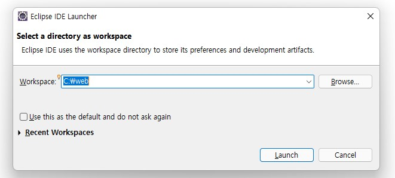

> Tip. 이 Launcher에 폴더명을 쓰고 Launch를 누르면, (존재하지 않는 폴더일 경우) 그 폴더가 해당 경로에 만들어진다.

<br>

**자바버전 세팅**

- 가끔 JRE 버전이 컴퓨터에 다운되어 있는 Java 버전과 다를 때가 있어서 버전을 바꿔줘야 한다.

1. eclipse에서 위의 **Window > Preference**를 클릭하자.

   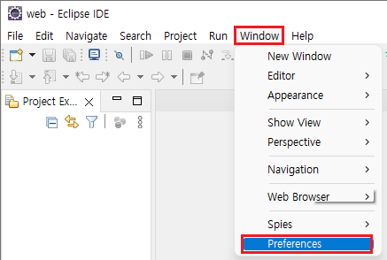

<br>

2. Preference 창에서 **Java**를 선택하고 **Installed JERs**를 클릭하면 아래와 같은 화면이 나온다.

   여기서 Installed JREs 목록에 있는 Java 버전이 자신의 Java 버전과 다를 때, **해당 jre를 클릭**하고 **Edit**을 누른다.

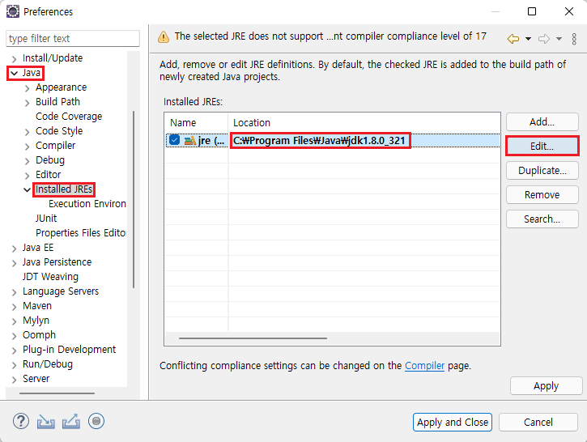

<br>

3. Edit JRE창에서 **Directory...**를 눌러 Java가 다운되어 있는 폴더 안에서 **JDK 폴더**를 찾아 선택한 후,

   **Finish**를 누른다.

   그 후 남아 있는 Preference 창도 **Apply and Close**를 눌러서 끈다. 

> 내 자바는 로컬디스크\Program Files\Java에 다운해 놓았다.

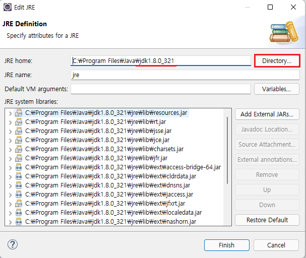

<br>

**80 Port 문제 시 - 현재 80포트가 사용되고 있는 것을 중지시킨다.**

- 제어판 > 관리 > 서비스 > world wide web publishing 서비스

  '실행'으로 되어있을 때, 중지 후 '수동'으로 바꾼다.

  > Windows 11 Home인 경우나 이 부분이 없는 경우, 생략 가능하다.
  >

<br>

## 1) STS 환경세팅

- **STS(Spring Tool Suite)**: 스프링 어플리케이션 개발을 위한 eclipse 기반의 개발환경
- eclipse 마켓플레이스에서 STS 플러그인을 다운할 것이다. 

<br>

1. eclipse에서 위의 **Help** **>** **Eclipse Marketplace**를 클릭하자.

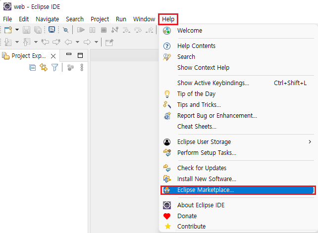

<br>

2. 새 창으로 뜬 Eclipse Marketplace에서 검색창에 "STS"라고 치면

   	- **Spring Tools 3 (Standalone Edition)**
   	
   	- **Spring Tools 3 Add-On**

​		이 나온다.

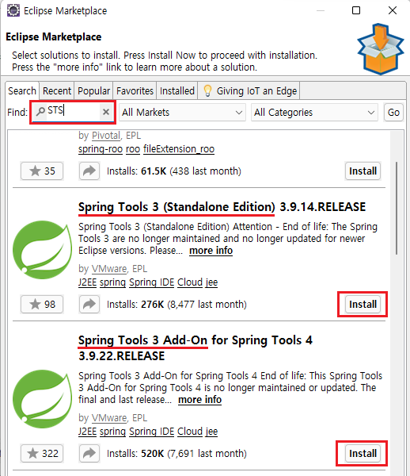

<br>

3. **Spring Tools 3 (Standalone Edition) -> Spring Tools 3 Add-On 순**으로 install 버튼을 눌러 다운하자.

   - 하나를 다운할 때마다 이클립스가 자동으로 재시작 될 것이다.
- 재시작 시간이 오래 걸릴 수 있으니 (응답없음)이 뜨더라도 인내심을 가지고 재시작을 기다리자.

<br>

3. 두 개 다 설치 했다면 다시 Eclipse Marketplace에 들어가 installed를 눌러 다운이 되었는지 확인하자.

   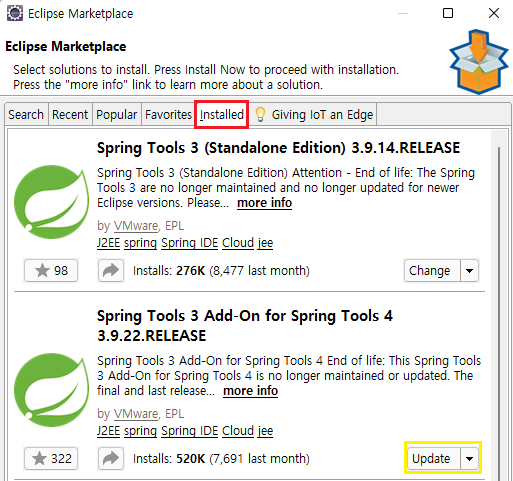

> Spring Tools 3 Add-On 밑에 Update를 안 해도 상관없다.

<br>

## 2) SpringBoot Web Application 환경 세팅

이제 SpringBoot Web Application을 만들기 위해:

- 프로젝트를 만들 때, SpringBoot를 세팅한다.

- Web Application을 만들기 위해 만들어진 프로젝트를 수정한다.

<br>

### SpringBoot 세팅 - 프로젝트 생성

1. Eclipse에서 **File > New > Project...** 를 눌러서 새 프로젝트를 생성한다.

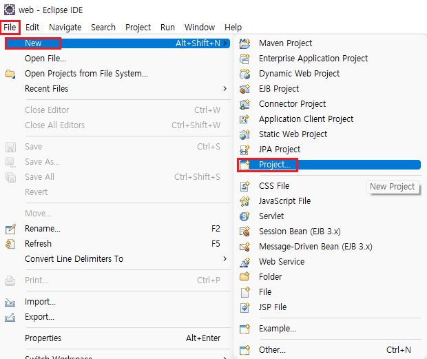

<br>

2. New Project 창에서 **Spring Boot 폴더** > **Spring Starter Project**를 선택하고 **Next**를 누른다.

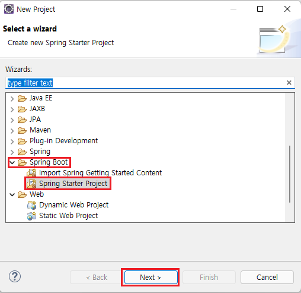

<br>

3. 프로젝트 **Name**을 원하는 대로 바꾸고 

   > Location과 Artifact는 자동으로 바뀐다

   - **Java Version** - 자기 버전
   - **Packaging** - War
   - **Group과 Package** - 원하는 대로

   > Tip. 두 개의 이름을 같게 하면 알아보기 쉽다.

   **Next**를 누른다.

   <br>

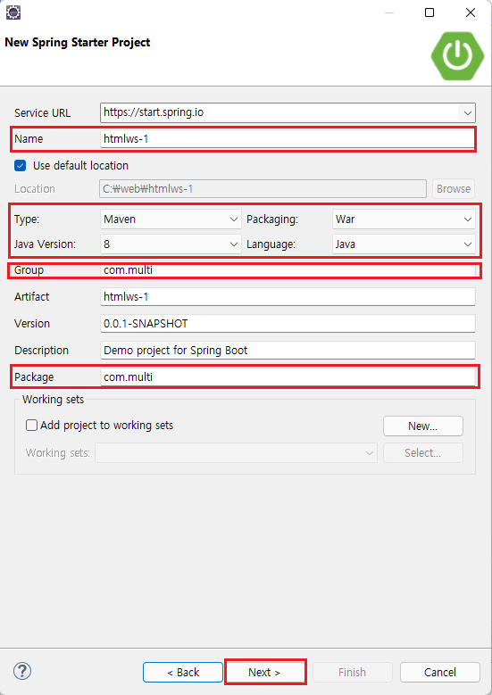

<br>

>나
>
>- Name - html1
>- Java Version - 8
>- Group & Package - com.multi

<br>

4. Dependencies 라이브러리를 고르는 창이 나오면 아래 두 개를 고르고 **Finish**를 누른다.

   - Developer Tools
     - **Spring Boot DevTools**
   - Web
     - **Spring Web**

   > jdk에 기본으로 존재하지 않는 라이브러리들이 나온다. 
   >
   > 이후 더 많은 라이브러리를 사용할 것이지만 초반이기 때문에 이 두 개만 선택한다.

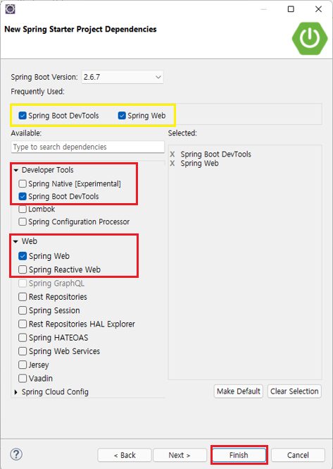

> Tip. 한 번 프로젝트를 만들면 이후 프로젝트를 만들 때 노란색 상자처럼 전에 사용했던 dependencies를 보여준다.

<br>

5. Finish를 누르면 이렇게 SpringBoot 프로젝트가 생성된다.

   > 맨 처음 프로젝트를 생성하게 되면 프로젝트가 완전히 생성되는데 시간이 걸린다.

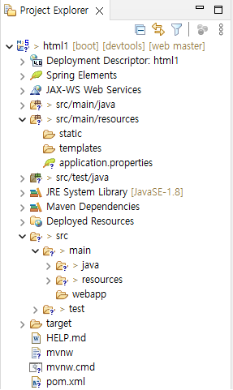

<br>

#### 시스템  정상작동 확인

1. 해당 **프로젝트 폴더 우클릭 > Run as > Spring Boot App**으로 실행.

2. 정상적으로 작동한다면 밑에 Console 창에서 서버 연결이 실행된다.

3. Console창 오른쪽 위에 **을 눌러 서버연결을 종료**한다.

   > 서버연결을 종료 해주는 것이 중요하다.
   >
   > - 서버연결이 중첩되면 포트가 이미 사용중으로 뜨기 때문에 오류가 난다.

- **프로젝트**
  - 아이콘 **M**: Maven을 사용해 외부 라이브러리를 다운해서 쓰는 프로젝트라는 뜻.
    - Maven 외부 라이브러리가 다운되어 있는 폴더 
      - 폴더경로: ```C:\Users\username\.m2```
  - 아이콘 **S**: SpringBoot 프로젝트라는 뜻.

- **생성된 폴더**
  
  - **src**: 개발 코드가 들어가는 폴더
  - **java**: 서버 연결 등의 프로그래밍 파일들이 들어가는 폴더 
    - 원래 src 밑에 있는 폴더인데 편하라고 빼놓음
  - **resources**: image나 비디오 또는 css가 들어가는 폴더
  - **test**: test하는 folder 
  - src > main > **webapp**: html 파일이 들어가는 폴더
  
  <br>

#### Maven 외부 라이브러리 사용방법

- JDK에서만 제공해주는 라이브러리만으로는 웹개발을 못하므로 dependencies 창에서 외부 라이브러리를 선택해 탑재한다.

- 자동으로 **pom.xml**이라는 파일에 필요한 라이브러리를 적어서 다운해준다.

  > 이 pom.xml 파일은 프로젝트 폴더 안에서 찾을  수 있다.
  >
  > pom.xml 파일에 필요한 라이브러리를 dependency로 직접 써서도 라이브러리를 가져올 수 있다.

- pom.xml에서 명시된 라이브러리를 Maven 서버에 접속하여 자동으로 다운해 가져와 준다.

  <br>

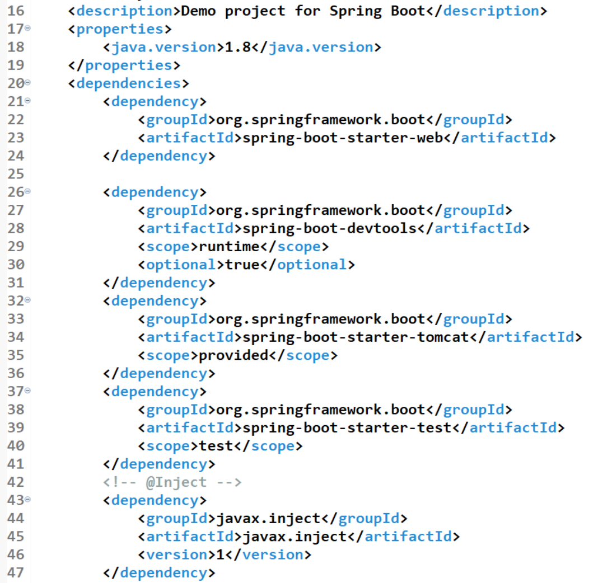

<br>

#### 프로젝트 라이브러리 확인하기

1. 프로젝트에 우클릭 > Build Path > Configure Build Path...

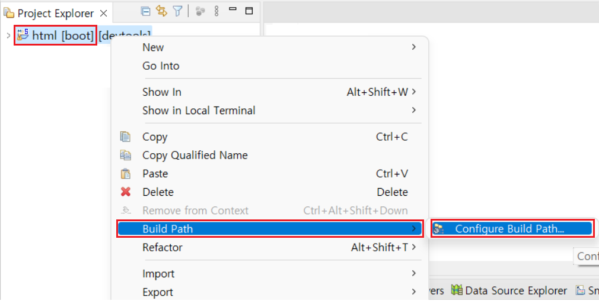

<br>

2. Java Build Path 창에서 Libraries를 선택하면 우리가 Maven 라이브러리를 가져왔기 때문에 Maven Dependencies라고 있을 것이다.
3. Maven Dependencies를 클릭하면 펼쳐지면서 현재 프로젝트가 가지고 있는 라이브러리가 보인다.

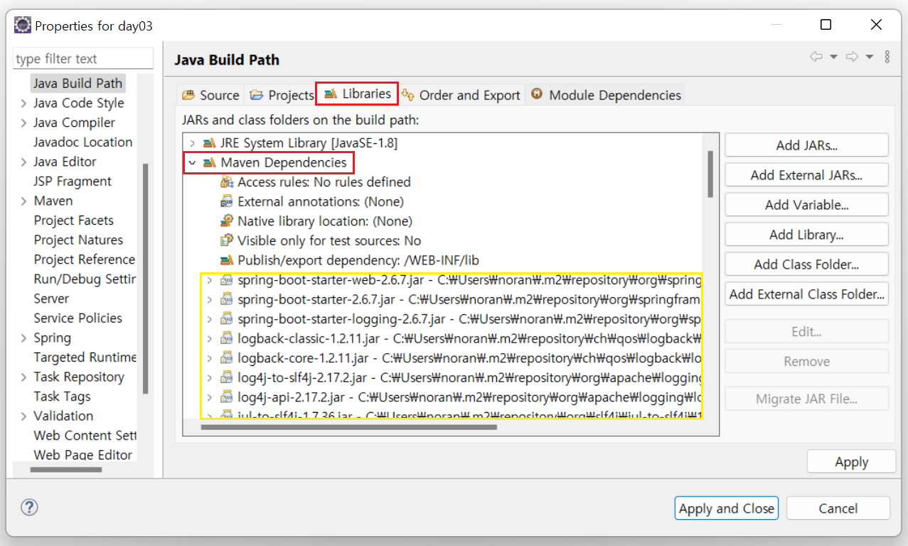

<br>

- 아직 이 프로젝트로 WEB을 만들 수 없다.
- 이제 WEB Server와 연동 해 줄 것이다.

<br>

<br>

### 필요 Dependency 가져오기

- pom.xml 파일에서 ```<dependencies></dependencies>``` 안에 아래의 코드를 삽입한다.
  - tomcat, JSON, WEB 관련 dependency 중에 프로젝트 생성단계에서 선택할 수 없는 것들을 pon.xml에 직접 삽입해서 가져온다.
	- 저장하면 자동으로 dependency들이 업데이트 될 것이다.
	
	> 파일에 느낌표가 떠도 괜찮다.

	```sql
	<!-- @Inject -->
	
		<dependency>
			<groupId>javax.inject</groupId>
			<artifactId>javax.inject</artifactId>
			<version>1</version>
		</dependency>
		
		<!-- Servlet -->
	
		<dependency>
			<groupId>org.apache.tomcat.embed</groupId>
			<artifactId>tomcat-embed-jasper</artifactId>
			<scope>provided</scope>
		</dependency>
	
		<dependency>
			<groupId>javax.servlet</groupId>
			<artifactId>javax.servlet-api</artifactId>
			<version>3.0.1</version>
			<scope>provided</scope>
		</dependency>
		<dependency>
			<groupId>javax.servlet</groupId>
			<artifactId>jstl</artifactId>
			<version>1.2</version>
		</dependency>
		
		<!-- json request -->   
	
		<dependency>
  		<groupId>com.googlecode.json-simple</groupId>
			<artifactId>json-simple</artifactId>
			<version>1.1</version>
			</dependency>
	```

<br>

- Dependency가 업데이트 되지 않을 때
  - pom.xml에 **우클릭 > Maven > Update Project...**

<br>

### Port 및 jsp 파일 경로 설정

> 프로젝트의 resources > application.properties를 눌렀을 때, 에러가 뜨는 경우.

- src > main > recources 폴더에 있는 application.properties 파일을 메모장으로 열어서 밑의 코드를 복붙하고 저장한다.

  ```sql
  server.port=80												/* 1. 80포트를 쓰겠다. */
  spring.mvc.view.prefix=/WEB-INF/views/						/* 2. .jsp 확장자의 파일을 /WEB-INF/view/ */
  spring.mvc.view.suffix=.jsp									/* 	   폴더에 저장할 것이다. */
  ```

<br>

<br>

## WEB 실행

1. html 파일을 만든다.
   - scr > main >  webapp 폴더에 html 파일을 생성한다.
   - 예를 들어, ```<h1>Main<h1>```같이 실험용 문구를 쓴다.

2. 부라우저에 해당 URL을 쓴다. 

	> 브라우저에서 서버에게 해당 html 파일을 요청한다.

	```
	http://127.0.0.1:80/fileName.html
	```
	
	- ```127.0.0.1``` : 컴퓨터 기본 IP
	
	- ```80```: 네트워크 Port
	  - application.property 파일에 80으로 지정했기 때문에 80을 쓰게 된다.
	  - 80을 안 써도 월드와이드 웹 기본포트가 80이기 때문에 80이 자동으로 쓰여진다.
	

> Tip. 서버가 실행 중일 때 html을 요청해서 화면에 띄울 수가 있다.
>
> 포트는 한 번에 한 서버만을 연계하기 때문에 여러 프로젝트가 동시 실행이 불가하다.


[맨위로](#개요)


